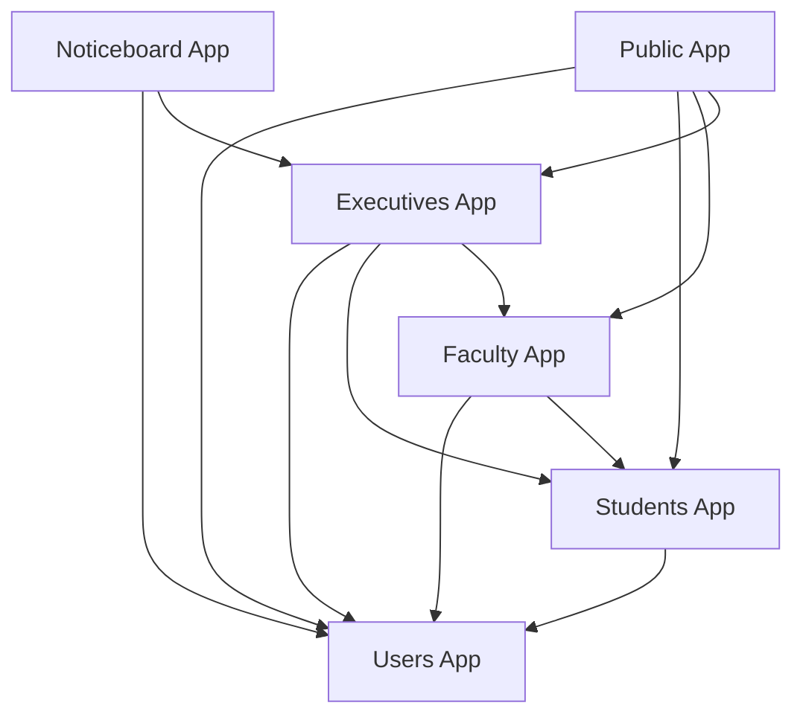

# University Management System

The **University Management System** is a large-scale, modular Django project designed to streamline and digitize the academic, administrative, and communication processes of a university or college. It provides a robust, extensible, and secure platform for students, faculty, executives, and the public, supporting everything from course management and assessments to notifications, noticeboards, and internal messaging.

---

## Table of Contents

- [Project Overview](#project-overview)
- [Core Features](#core-features)
- [System Architecture](#system-architecture)
- [App-by-App Analysis](#app-by-app-analysis)
  - [executives](#executives)
  - [faculty](#faculty)
  - [noticeboard](#noticeboard)
  - [public](#public)
  - [students](#students)
- [Directory Structure](#directory-structure)
- [App Dependency Diagram](#app-dependency-diagram)
- [Component Diagram](#component-diagram)
- [Installation & Setup](#installation--setup)
- [Customization & Extensibility](#customization--extensibility)
- [Security & Best Practices](#security--best-practices)
- [API Endpoints](#api-endpoints)
- [Contributing](#contributing)
- [Contact](#contact)
- [License](#license)
- [Acknowledgments](#acknowledgments)

---

## Project Overview

This project is a full-featured university management platform, built with Django, that covers the needs of all major user groups:

- **Students:** Academic management, personal dashboards, mailbox, notifications, ratings, and reviews.
- **Faculty:** Course and assessment management, quiz creation, document sharing, and student assessment tracking.
- **Executives:** Administrative dashboards, batch and enrollment management, lab management, result processing, and notifications.
- **Public:** Informational pages, course and degree listings, lab info, and public notifications.
- **Noticeboard:** Centralized notice management and publication with approval workflows.

The system is designed for modularity, scalability, and maintainability, with each app encapsulating a specific domain of functionality.

---

## Core Features

- **Role-Based Dashboards:** Custom dashboards for students, faculty, and executives.
- **Course, Degree, and Term Management:** CRUD operations, assignment, and tracking.
- **Assessment & Quiz Management:** Creation, submission, grading, and analytics.
- **Batch & Enrollment Management:** Batch creation, instructor assignment, student enrollment, and statistics.
- **Lab Management:** Lab project and photo management, lab APIs.
- **Result Processing:** Calculation, image generation, and emailing of results.
- **Internal Messaging:** Mailbox for threaded discussions and notifications.
- **Noticeboard:** Notice creation, approval, and publication.
- **Ratings & Reviews:** Feedback for courses and instructors.
- **Public Portal:** Home page, course/degree/term/lab listings, and notifications.
- **Security:** Role-based access, input validation, CSRF protection, and moderation.
- **Custom Middleware:** For user roles, image fallback, rate limiting, and payload size checks.

---

## System Architecture

The project is organized as a Django monorepo, with each major domain encapsulated in its own app. Apps communicate via Django’s ORM, signals, and shared models. Static assets and templates are organized per app for maintainability.

### High-Level Structure

```
another_test/
│
├── executives/
├── faculty/
├── noticeboard/
├── public/
├── students/
├── manage.py
├── requirements.txt
└── ... (project-level files)
```

---

## App-by-App Analysis

### executives

**Purpose:**  
Administrative backbone for executive users, providing dashboards, management tools for faculties, departments, courses, degrees, terms, batches, enrollments, labs, students, instructors, notifications, and result processing.

**Key Modules:**
- `components/`: Modular managers for each domain (faculty, department, course, degree, student, term, batch, enrollment, etc.).
- `lab_api.py`: APIs for lab management.
- `result_components/`: Result calculation, image generation, and emailing.
- `middleware.py`: Custom middleware for user roles, image fallback, rate limiting, and payload size.
- `urls.py` & `views.py`: Central routing and view logic.
- `additional_business_logics/`: Data formatting and business logic helpers.

**Templates & Static:**  
Rich set of templates and static files for dashboards, management interfaces, and result displays.

---

### faculty

**Purpose:**  
Empowers instructors with tools for course management, assignment and quiz creation, document sharing, and assessment tracking.

**Key Modules:**
- `components/`: Assignment, course, document, and quiz management.
- `additional_business_logic/`: Data formatting utilities.
- `urls.py` & `views.py`: Routing and view logic for faculty operations.

**Templates & Static:**  
Templates for faculty home, course management, assignment/quiz creation, results, and profile. Static assets for interactive and styled interfaces.

---

### noticeboard

**Purpose:**  
Centralized notice management and publication with approval workflows.

**Key Modules:**
- `models.py`: Notice model with status (pending/approved/rejected), title, content, author, timestamps.
- `views.py`: Logic for notice creation, approval, and display.
- `urls.py`: Routing for noticeboard, manage post, and pending notices.

**Templates & Static:**  
Templates for noticeboard, manage post, and pending notices. CSS/JS for dynamic and responsive UI.

---

### public

**Purpose:**  
Public-facing portal for all users, providing informational pages, course/degree/term/lab listings, notifications, and navigation.

**Key Modules:**
- `components/notification_manager.py`: Logic for public notifications.
- `views.py`: Renders home, courses, degrees, labs, terms, notifications, and access denied pages.
- `urls.py`: Routing for all public pages.

**Templates & Static:**  
Templates for home, courses, degrees, labs, terms, notifications, and navigation. Static assets for styling and interactivity.

---

### students

**Purpose:**  
Manages all aspects of the student experience: academic management, personal dashboards, mailbox, notifications, ratings, reviews, enrollment, and SIS integration.

**Key Modules:**
- `components/`: Assessment, batch/instructor, enrollment, quiz, rating/review, result sheet, and SIS managers.
- `mailbox/`: Internal messaging system.
- `notifications.py`: Notification logic for students.
- `templatetags/custom_tags.py`: Custom template tags for reusable logic.
- `academic_urls.py`, `personal_urls.py`, `urls.py`: Modular routing for academic and personal features.
- `views.py`: Main view logic for student dashboards and features.

**Templates & Static:**  
Extensive templates for academic, personal, and mailbox features. Static assets for academic, mailbox, and personal interfaces.

---

## Directory Structure

```
another_test/
│
├── executives/
│   ├── admin.py
│   ├── apps.py
│   ├── lab_api.py
│   ├── middleware.py
│   ├── models.py
│   ├── tests.py
│   ├── to_fix.txt
│   ├── urls.py
│   ├── views.py
│   ├── additional_business_logics/
│   ├── components/
│   ├── result_components/
│   ├── static/
│   └── templates/
│
├── faculty/
│   ├── admin.py
│   ├── apps.py
│   ├── models.py
│   ├── tests.py
│   ├── to_fix.txt
│   ├── urls.py
│   ├── views.py
│   ├── additional_business_logic/
│   ├── components/
│   ├── migrations/
│   ├── static/
│   └── templates/
│
├── noticeboard/
│   ├── admin.py
│   ├── apps.py
│   ├── models.py
│   ├── urls.py
│   ├── views.py
│   ├── migrations/
│   ├── static/
│   └── templates/
│
├── public/
│   ├── admin.py
│   ├── apps.py
│   ├── models.py
│   ├── tests.py
│   ├── urls.py
│   ├── views.py
│   ├── components/
│   ├── migrations/
│   ├── static/
│   └── templates/
│
├── students/
│   ├── __init__.py
│   ├── academic_urls.py
│   ├── admin.py
│   ├── apps.py
│   ├── models.py
│   ├── notifications.py
│   ├── personal_urls.py
│   ├── requirements.txt
│   ├── tests.py
│   ├── urls.py
│   ├── views.py
│   ├── components/
│   ├── mailbox/
│   ├── migrations/
│   ├── static/
│   ├── templates/
│   └── templatetags/
│
├── manage.py
├── requirements.txt
└── ... (project-level files)
```

---

## App Dependency Diagram



---

## Component Diagram

```mermaid
graph TD
    V[Views]
    M[Models]
    T[Templates]
    F[Forms]
    S[Signals]
    C[Components (Business Logic)]
    
    V --> T
    V --> F
    V --> M
    V --> C
    F --> M
    S --> M
    C --> M
    C --> V
```

---

## Installation & Setup

1. **Clone the repository:**
    ```bash
    git clone https://github.com/VasudevAdhikari/ums.git
    ```

2. **Install dependencies:**
    ```bash
    pip install -r requirements.txt
    ```

3. **Configure your database and environment variables in `settings.py`.**

4. **Apply migrations:**
    ```bash
    python manage.py migrate
    ```

5. **Create a superuser (for admin access):**
    ```bash
    python manage.py createsuperuser
    ```

6. **Run the development server:**
    ```bash
    python manage.py runserver
    ```

---

## Customization & Extensibility

- **Templates:**  
  Each app’s templates can be extended or overridden for branding and custom workflows.

- **Static Assets:**  
  CSS, JS, and images are organized per app for easy customization.

- **Components:**  
  Business logic is encapsulated in components for maintainability and extension.

- **APIs:**  
  Extend or add new API endpoints for integration with mobile apps or external systems.

- **Signals & Hooks:**  
  Use Django signals for cross-app communication (e.g., notifications on assessment submission).

---

## Security & Best Practices

- **Role-Based Access:**  
  Strict access controls for all sensitive features.

- **Input Validation:**  
  Comprehensive backend and frontend validation.

- **CSRF Protection:**  
  All forms and AJAX requests are CSRF-protected.

- **Moderation:**  
  Admins can moderate posts, comments, and notices.

- **File Validation:**  
  Only allowed file types can be uploaded.

---

## API Endpoints

Each app exposes its own set of endpoints. Here are some examples:

| App         | Endpoint                                 | Method | Description                                 |
|-------------|------------------------------------------|--------|---------------------------------------------|
| students    | `/students/academic/`                    | GET    | Academic dashboard                          |
| students    | `/students/academic/assessment/`         | GET    | View and submit assessments                 |
| students    | `/students/academic/quiz/`               | GET    | Take quizzes                                |
| students    | `/students/mailbox/`                     | GET    | Main mailbox feed                           |
| faculty     | `/faculty/assignments/`                  | GET    | View and manage assignments                 |
| faculty     | `/faculty/quizzes/`                      | GET    | Create and manage quizzes                   |
| executives  | `/executives/dashboard/`                 | GET    | Executive dashboard                         |
| executives  | `/executives/batch/`                     | GET    | Manage batches                              |
| noticeboard | `/noticeboard/`                          | GET    | View all approved notices                   |
| noticeboard | `/noticeboard/manage_post/`              | POST   | Create or edit a notice                     |
| public      | `/`                                      | GET    | Public home page                            |
| public      | `/courses/`                              | GET    | List all courses                            |

---

## Contact

For support or questions, please contact the project maintainer:

- **Name**: Moe Thiha  
- **Phone**: +959 989377380  
- **Telegram**: [@moethihaAdk](https://t.me/moethihaAdk)  
- **Facebook**: Vasudev Adhikari

---

## License

This project is licensed under the MIT License. See the [LICENSE](LICENSE) file for details.

---

## Acknowledgments

- Django Documentation
- Bootstrap Documentation
- MySQL/PostgreSQL Documentation
- All contributors and testers
- Special thanks to **GitHub Copilot** and **Cursor** for AI-powered code suggestions and documentation assistance.

---